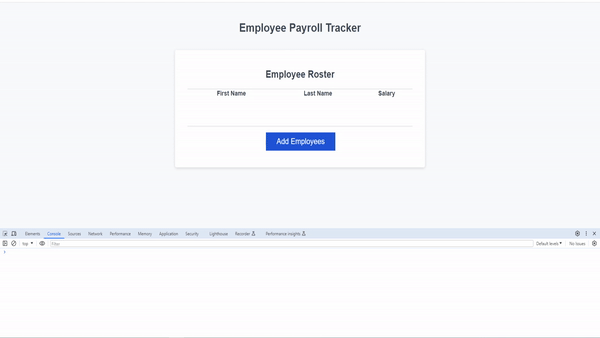

# Employee Roster Tracker

Welcome to the Employee Payroll Tracker, Here you will be able to add your employees Names and Salary to a tracking sheet.

[Click Here](https://CinosMagician.github.io/employee-roster-tracker) to view the live webpage

## Disclaimer

This webpage is still a work in progress, and as such, certain elements have been left as default or placeholder. Projects will be updated later to have a corresponding image and project name will be replaced with an appropreate name.

Besides the GitHub link, none of the contact info is correct and will not take you anywhere as of this stage. These will also be updated in the future.

## Usage

Clicking on the Add Employees button will prompt you to enter in a First Name, then a Last Name and finally a Salary amount.
You will then be prompted to either continue adding data or complete.
You can cancel at any time by pressing cancel or by enetering a blank input.

A table list will be displayed in alphabetical order of Last name

The console will also log infomation such as the array itself, along with the average salary of all employees listed and also select a random employee to be a winner.

Below is a demonstration of what you will expect for the webpage:

## License

[MIT](https://choosealicense.com/licenses/mit/)
